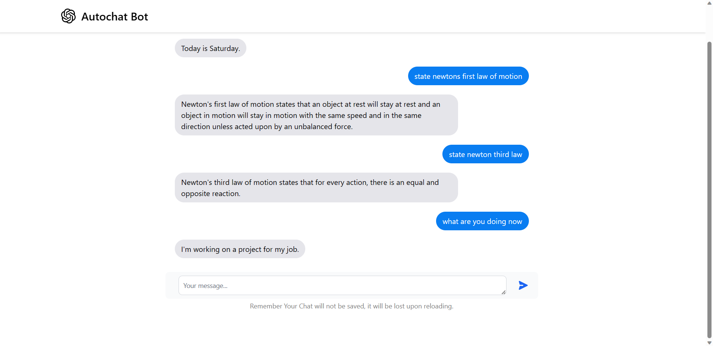

## Chat Bot with OpenAI API and Flask

Introducing the Flask Chat Bot powered by the OpenAI API! This innovative chat bot combines the flexibility and ease of use of Flask with the power of the OpenAI API to deliver intelligent and interactive conversations. With natural language processing capabilities, the chat bot can understand user queries and provide relevant responses in real time. Whether it's customer support, information retrieval, or just casual conversation, our chat bot is ready to engage and assist users with its advanced AI capabilities. Get ready for an immersive and dynamic chat experience like never before!

## Prerequisites

- Python 3.9 or higher
- Flask
- OpenAI API
- OpenAI Python library

## Getting Started

* Set up API Key in .env file (API=api-key)

## To-Do

* Merge Quickbooks log-in 
* Merge email functionality
* Implement Quickbooks invoices (and other API functionality)
* Implement financial analysis and reports
